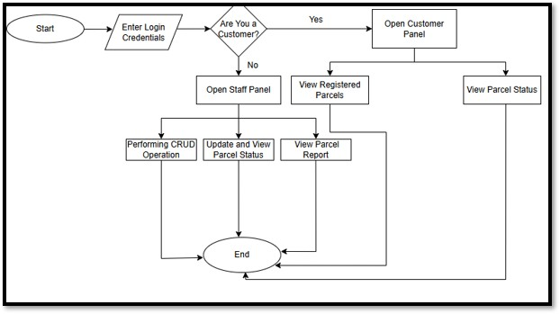
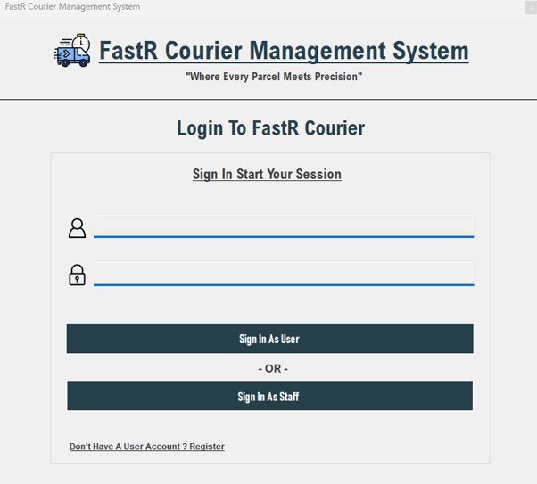
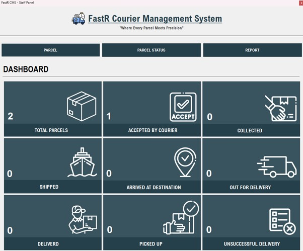

# FastR CMS — Courier Management System (Desktop Application)

A Windows desktop application for managing courier and parcel operations, built with C# Windows Forms and backed by a MySQL database. This is the desktop counterpart to a full courier management workflow — covering staff-side parcel operations and a user-facing parcel tracking panel, all within a native Windows application.

## Overview & System Flow

The system is structured around two core panels — a **Staff Panel** for internal parcel operations and a **User Panel** for public parcel tracking — connected through a shared MySQL database. The flowchart below illustrates how a parcel moves through the system, from booking to final delivery status.



## Preview





## Features

### Authentication
- Secure login with separate sign-in paths for Staff and Users
- User registration (sign-up) with first name, last name, email, contact number, and password

### Staff Panel
- **Dashboard** — live overview of parcel counts by status: Total Parcels, Collected, Picked Up, Shipped, Out for Delivery, Arrived at Destination, Accepted by Courier, Delivered, and Unsuccessful Delivery
- **Parcel Details & Management** — insert, search, reset, and delete parcel records, including sender and receiver details, addresses, contact numbers, charges, and delivery date
- **Parcel Status Management** — look up a parcel by tracking number and update its current delivery status
- **Parcel Reporting** — generate and view parcel reports filtered by date range and parcel status

### User Panel
- Track a parcel in real time using its tracking number
- Print parcel status details directly from the application

## Built With

<p>
  
</p>

- **C#** — Core application logic
- **Windows Forms (.NET Framework 4.7.2)** — Desktop UI across all panels and forms
- **MySQL** — Backend relational database (`fastr_db`)
- **MySql.Data** — Official MySQL connector for .NET, handling all database communication
- **Visual Studio** — Development environment and solution structure

## Project Structure

```
Courier-Management-System-Desktop-Application/
├── FastR CMS/
│   ├── FastR CMS.sln              # Visual Studio solution file
│   ├── FastR CMS/
│   │   ├── Form1.cs / .Designer.cs   # Login screen (Staff / User sign-in)
│   │   ├── Form2.cs / .Designer.cs   # User sign-up / registration
│   │   ├── Form3.cs / .Designer.cs   # Staff dashboard — parcel status overview
│   │   ├── Form4.cs / .Designer.cs   # Parcel details & management (CRUD)
│   │   ├── Form5.cs / .Designer.cs   # Parcel status update
│   │   ├── Form6.cs / .Designer.cs   # Parcel reporting
│   │   ├── Form7.cs / .Designer.cs   # User panel — parcel tracking
│   │   ├── Program.cs                # Application entry point
│   │   └── Properties/                # Assembly info and app settings
│   └── packages/                    # NuGet package dependencies
├── flowchart.jpg                    # System flow diagram
├── login.jpg                        # Login screen screenshot
└── dashboard.jpg                    # Staff dashboard screenshot
```

## Getting Started

Clone the repository:

```bash
git clone https://github.com/AbdulRehman2345/Courier-Management-System-Desktop-Application.git
```

Open `FastR CMS/FastR CMS.sln` in Visual Studio, restore the NuGet packages, set up a local MySQL database named `fastr_db`, and run the application.


## Purpose

This project was built to demonstrate the design and development of a role-based desktop business application from the ground up — covering UI design in Windows Forms, relational database integration with MySQL, parcel lifecycle management, and status-driven reporting, all within a native desktop environment.

## Author

**Abdul Rehman** — Software Engineer

[LinkedIn](https://www.linkedin.com/in/abdul-rehman-750208312)

## License

This project is open source and available for reference. Feel free to explore the code.


